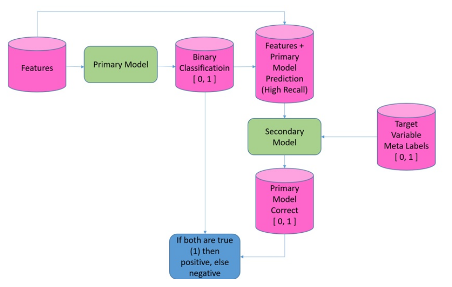

# Testing Metalabeling Strategy

This repository contains experiments and implementations related to the Metalabeling strategy applied to both stock and cryptocurrency trading systems.

  
*The figure represents the Metalabeling process, sourced from the master's thesis available at [this link](https://urn.fi/URN:NBN:fi:amk-2021060313890).*

## Data

The project uses two main data folders:

- **Data_AAPL**: Contains intermediate data for Apple stock trading experiments.
- **Data_Crypto**: Contains intermediate data for cryptocurrency trading experiments.

## Experiments

The repository includes four Jupyter notebooks, each focusing on different aspects of the trading strategy:

1. **Apple Trading System Breakout Donchian Channel.ipynb**: Implements a trading strategy for Apple stock based on breakout signals using Donchian Channels (primary strategy / model).
2. **Apple Trading System Metalabeling Gradient Boosting.ipynb**: Applies Metalabeling with Gradient Boosting to optimize the trading signals for Apple stock.
3. **CRYPTO Trading System Donchian Channel.ipynb**: Implements a trading strategy for cryptocurrency using Donchian Channels (primary strategy / model).
4. **CRYPTO Trading System Metalabeling Gradient Boosting.ipynb**: Applies Metalabeling with Gradient Boosting to optimize the trading signals for cryptocurrency.

The code for the primary models in these notebooks is primarily derived from the book ["Strategie di Trading con Python"](https://www.hoepli.it/libro/strategie-di-trading-con-python/9788820396459.html).

## References

Here are some useful references related to the Metalabeling strategy and trading systems:

- **What is Corrective AI?**: [LinkedIn Article](https://www.linkedin.com/pulse/what-corrective-ai-ernest-chan/)
- **What is the Probability of Profit of Your Next Trade? (Introducing predictnow.ai)**: [LinkedIn Article](https://www.linkedin.com/pulse/what-probability-profit-your-next-trade-introducing-ernest-chan/)
- **Conditional Parameter Optimization: Adapting Parameters to Changing Market Regimes via Machine Learning**: [LinkedIn Article](https://www.linkedin.com/pulse/conditional-parameter-optimization-adapting-parameters-ernest-chan/)
- **Quantitative Trading: How to Build Your Own Algorithmic Trading Business**: [Amazon](https://www.amazon.it/Quantitative-Trading-Build-Algorithmic-Business/dp/1119800064/)
- **Strategie di Trading con Python**: [Hoepli](https://www.hoepli.it/libro/strategie-di-trading-con-python/9788820396459.html)
- **Exploration of a Trading Strategy System Based on Metalabeling and Hybrid Modeling Using the SigTech Platform**: [Thesis](https://urn.fi/URN:NBN:fi:amk-2021060313890)
